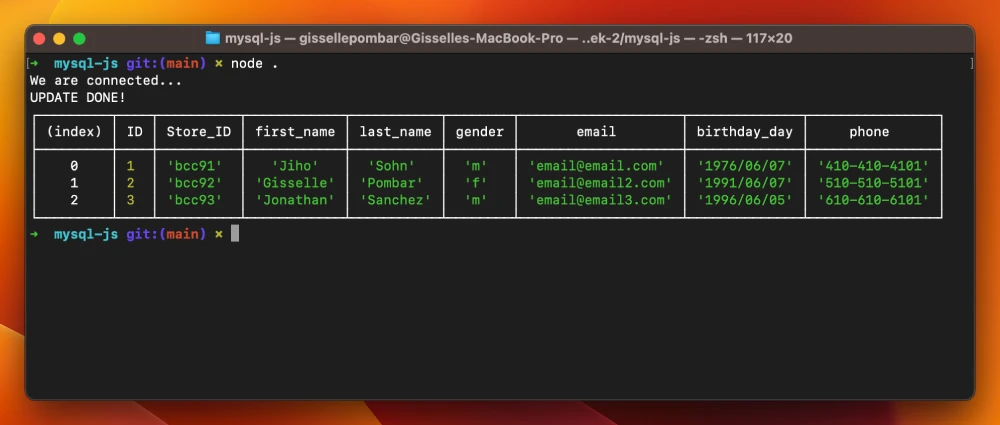

# MySQL with JavaScript

Week 2, Day 2. Connecting MySQL with JavaScript using Node.

## Lesson Learned
1. Node
2. NPM
3. MySQL
4. Secrets

To see the repo [click here](https://github.com/gissellepombar/MySQL-JS).

## Node Packages 
- mysql2

## MySQL
- version 8.0.0
    - localhost

